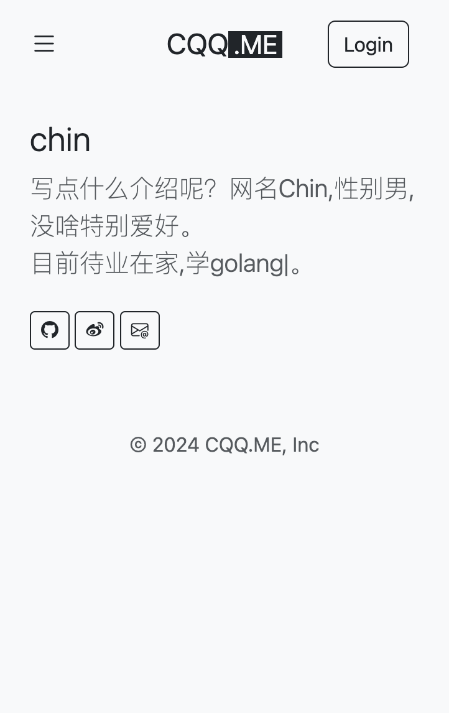
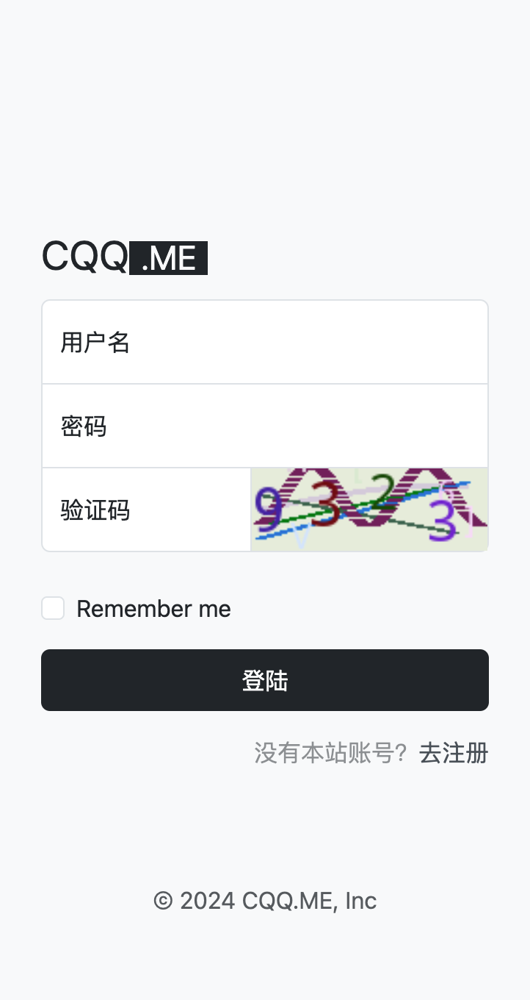
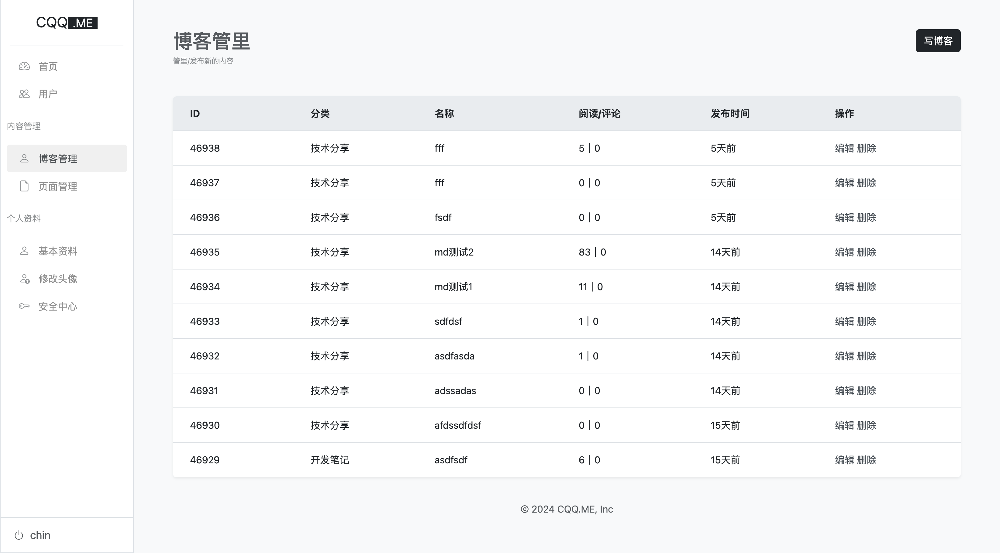

# 1. go-blog
最近有空想学习golang，决定找个框架看看于是发现了goframe，根据官方的的[focus-single](https://github.com/gogf/focus-single) 写了这个博客系统

# 2. Quick start


1. Download the source code
```
git clone https://github.com/QiaChen/go-blog.git
cd go-blog
```
2. Import Db
Import manifest/document/go-blog.sql to your Mysql

3. Run
```
cp manifest/config/config.example.yaml manifest/config/config.yaml
gf run main.go
```

3. Enjoy it
   then open http://127.0.0.1:8199/ and enjoy it.

```
user:     goframe
password: 123456
```

# 3. Preview






